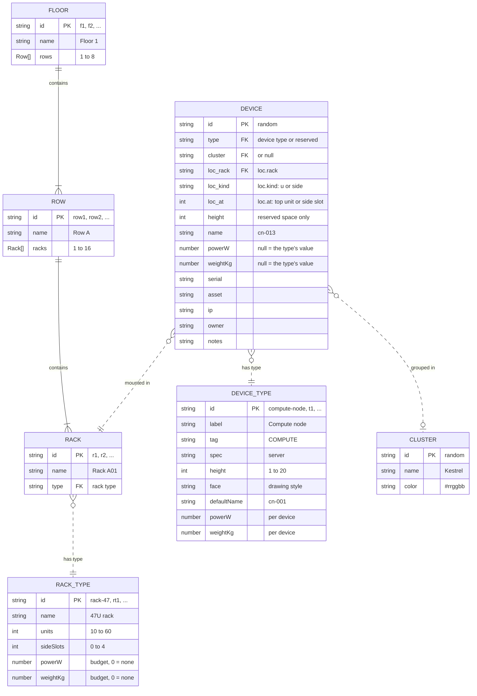

# Rackplanner

<picture>
  <source media="(prefers-color-scheme: dark)" srcset="docs/screenshots/elevation-dark.png">
  
</picture>

A single-page app for planning datacenter rack layouts, right in the browser.
Racks stand in rows, rows on floors, and each row is drawn in elevation view as
a schematic drawing sheet. You place switches, servers, storage and anything
else from a catalog you can extend, and track space, power and weight against
each rack's budget. Devices get their own names and belong to color-coded
clusters, so the equipment that works together stands out.

**[Open Rackplanner](https://dennisklein.github.io/rackplanner/)**: it starts
with an example plan of two floors, which you can explore, keep editing or
swap for empty racks. It works with a mouse, the keyboard or touch, in a
light or dark theme. For a tour first, **[watch the 27-second intro
video](https://dennisklein.github.io/rackplanner/media/)**.

There is no server and no build step: plain HTML, CSS and JavaScript. Plans are
saved in your browser and never uploaded; they work offline and can be
exported as files or shared as links.

Public domain under CC0 1.0: use it for anything, no strings attached. See [License](#license).

## Running it yourself

The [live version](https://dennisklein.github.io/rackplanner/) needs nothing
installed. To run your own copy, open `index.html` in a browser. It also works
from `file://`, except that there is no offline cache and share links point at
the file on your own disk.

Or serve the folder with any static web server:

```sh
npm start            # http://localhost:8080 via http-server
python3 -m http.server
```

It runs as is on any static host.

## What you can plan

| Level | Limits |
| --- | --- |
| Floors | 1 to 6 per plan |
| Rows | 1 to 8 per floor |
| Racks | 1 to 16 per row, 19″, 10U to 60U high, numbered from the top (U1) down |
| Side slots | 0 to 4 vertical 1U slots per rack, on the right, depending on its height |

Every rack has a **rack type**: its height, number of side slots, power budget
and maximum load. New plans come with a 47U rack (the default, 12 kW, 1200 kg),
a 42U rack and a 48U high-density rack.

**Device types** come from the plan's catalog. New plans start with these:

| Device | Height | Front |
| --- | --- | --- |
| 48-port switch | 1U | 48 × RJ45 |
| 24-port switch | 1U | 24 × QSFP |
| Compute node | 2U | server, drive bays |
| Storage node | 4U | server, 24 × 3.5″ bays |
| Storage enclosure | 4U | JBOD, 2 drawers |

The catalog editor adds more, from templates (1U server, GPU server, patch
panel, PDU, UPS, blanking panel, generic device) or from scratch: pick a
name, height (1U to 20U), a drawing style, typical power draw and weight.
**Reserved space** is always available too: a hatched placeholder of any height
that keeps units free for planned equipment and can carry the power it will draw.

The side slots take 1U devices only. Devices there are drawn rotated, which
makes a 1U PDU look like a vertical power strip.

## Using it


- **Place**: drag a device from the left panel onto a rack, or click it and
  then click a free slot (on a touch screen, tap it and then tap a slot). A
  green outline means it fits; red explains the conflict.
- **Name and cluster**: the placement dialog asks for a name and a cluster
  (a named color). It suggests both from the nearest device of the same type,
  so dropping a node next to `cn-012` offers `cn-013` in the same cluster.
  You can create a new cluster with its own color right there.
- **Several at once**: set a quantity to stack devices downward or upward from
  the drop point. Occupied units are skipped and names count up (`cn-013 … cn-020`).
  Tick **Spread evenly across racks in this row** and pick the racks to share
  them out; a rack that runs out of space leaves the rest to the others.
- **Move**: drag devices between units, racks and side slots. Hold <kbd>Alt</kbd>
  while dropping to copy instead.
- **Edit a device**: select it to rename it, change its cluster, move it to any
  rack in the plan, and fill in its serial number, asset tag, IP address,
  owner and notes. Power and weight come from its type unless you enter
  its own values.
- **Select several**: <kbd>Shift</kbd>-click devices, <kbd>Shift</kbd>-drag
  across the empty sheet, press <kbd>Ctrl</kbd>+<kbd>A</kbd> for the whole row,
  or use the select buttons on a rack, row or cluster. Then move them
  together (drag, or the arrow keys), duplicate them, give them one cluster
  or owner, rename them in series or delete them.
- **Duplicate**: <kbd>Ctrl</kbd>+<kbd>D</kbd> (or the Duplicate button) copies
  whatever is selected. A device or a group of devices is copied into the
  nearest free space, below it first, then above, then in the neighbouring
  racks, keeping the group's layout; names continue each series (`cn-013`,
  `cn-014`). A rack, row or floor is copied with all its devices and
  inserted right after the original.
- **Clusters**: click one in the left panel to highlight its devices. Use the
  pencil icon to rename or recolor it.
- **Move around**: the bar above the drawing has a tab per floor, the row
  picker with previous and next buttons, and a switch between the
  **Elevation** of the current row and the **Floor map**. The floor map shows
  every row of a floor with a small drawing of each rack and a meter for
  space, power or weight; click a rack to open it, a row name to see its
  elevation.
- **Search**: type in the search box (or press <kbd>/</kbd>) to find floors,
  rows, racks and devices. Devices are found by name, type, cluster, serial
  number, asset tag, IP address or owner. Pick a result to jump there. While
  the search is on, matching devices stay highlighted in the drawing and
  marked on the floor map.
- **Racks, rows and floors**: click a rack's yellow label to rename it, change
  its type, move it left or right, insert a rack beside it, duplicate it,
  move it to another row or delete it. The dashed **Add rack** slot at the end
  of a row adds one. Row and floor settings (from the row picker, the pencil
  on the floor map, or a click on the active floor tab) rename, reorder, move
  and delete them, and show their totals.
- **Catalog**: the **Catalog** button above the devices edits device and
  rack types. Changes apply at once and are checked: a type can't grow if its
  devices would then overlap or stick out of their racks. Drag types by their
  grip to reorder them (or use the arrow buttons, or <kbd>Alt</kbd>+<kbd>↑</kbd>
  <kbd>↓</kbd>): the devices panel shows device types in this order, and
  racks in new rows get the first rack type.
- **Power and weight**: rack labels show units and kW used; a second bar fills
  toward the power budget and turns red, with a “!”, when a rack is over its
  power or weight budget. The inspector shows the numbers for a rack, row,
  floor or the whole plan.
- **Theme**: the button at the right end of the toolbar picks **Light**,
  **Dark** or **Match system**, which follows your device's setting (the
  default). The choice is remembered in this browser. Exported images and
  printouts always use the light theme.
- **Undo** everything with <kbd>Ctrl</kbd>+<kbd>Z</kbd>, redo with
  <kbd>Ctrl</kbd>+<kbd>Shift</kbd>+<kbd>Z</kbd> or <kbd>Ctrl</kbd>+<kbd>Y</kbd>.

<p>
  
  
</p>

| Shortcut | Action |
| --- | --- |
| <kbd>/</kbd> or <kbd>Ctrl</kbd>+<kbd>K</kbd> | Search |
| <kbd>[</kbd> <kbd>]</kbd> | Previous, next row |
| <kbd>M</kbd> | Floor map on or off |
| <kbd>↑</kbd> <kbd>↓</kbd> | Move the selected devices to the next free position |
| <kbd>←</kbd> <kbd>→</kbd> | Move them to the neighbouring rack |
| <kbd>Shift</kbd>+click, <kbd>Shift</kbd>+drag | Add to the selection, select an area |
| <kbd>Ctrl</kbd>+<kbd>A</kbd> | Select every device in the row |
| <kbd>Ctrl</kbd>+<kbd>D</kbd> | Duplicate the selected devices, rack, row or floor |
| <kbd>Enter</kbd> or <kbd>F2</kbd> | Rename the selected device |
| <kbd>Del</kbd> | Delete |
| <kbd>Tab</kbd> | Walk through devices, top to bottom |
| <kbd>Ctrl</kbd>+<kbd>Z</kbd>, <kbd>Ctrl</kbd>+<kbd>Shift</kbd>+<kbd>Z</kbd> | Undo, redo |
| <kbd>0</kbd> / <kbd>1</kbd> / <kbd>+</kbd> / <kbd>−</kbd> | Fit sheet / 100% / zoom |
| <kbd>Ctrl</kbd>+scroll | Zoom at the pointer |
| <kbd>Esc</kbd> | Cancel placing or dragging, deselect, clear the search |

On a Mac, use <kbd>⌘</kbd> for <kbd>Ctrl</kbd>. Drag the empty sheet to pan.

## Saving, sharing and exporting

Plans are saved in the browser's `localStorage` as you work. **Plans** lists
every plan in this browser to open, duplicate or delete; **New** starts an
empty plan, one with the current layout but no devices, or the example.
Plans saved by earlier versions are moved into the list automatically.

**Export** offers:

- **PNG image** and **SVG drawing** of the current row, with cluster legend and
  title block, always in the light theme.
- **Print or PDF**: one sheet per row, for the current row, floor or the whole
  plan, on A4, A3, Letter, Legal or Tabloid. The title block names the site,
  floor and row, author, revision, date and sheet number; fill these in on the
  plan overview (click the empty sheet to see it).
- **CSV inventory** of every device with floor, row, rack, position, type,
  cluster, serial number, asset tag, IP address, owner, power, weight and notes.
- **Plan file (.json)**, which **Open** reads back as a new plan. You can also
  copy the plan as JSON and paste it into Open on another machine.
- **Share link**: the whole plan, compressed into the link itself. Whoever opens
  it gets their own copy in their browser; nothing is uploaded. Very large
  plans make long links, so send the file instead if a chat program cuts it off.

<p align="center">
  <a href="docs/screenshots/sheet.png"></a>
  <br><em>Row B of the example, exported as a PNG</em>
</p>

**Open** also imports a **CSV inventory**, into a new plan or added to the
current one. It needs Rack, Position (`U12`, `U12-13` or `Side V1`) and Name or
Type columns; Floor, Row, Height, Cluster and the other columns of the export
are used when present. Missing floors, rows, racks and clusters are created by
name, and unknown types become generic types of the given height. Comma,
semicolon and tab separators all work.

Imported files are checked: devices that overlap or don't fit are skipped, and
everything that needed fixing is listed after the import.

## Offline and installing

The fonts are part of the app, and a service worker keeps a copy of all files,
so once the site has been opened it also works without a network. New
versions are picked up on the next visit while online. Browsers that install
web apps (Install or Add to Home Screen in their menu) can install it to run
in its own window.

## Project layout

```
index.html           page shell, icons and dialogs
css/app.css          styles, light and dark themes, print layout
css/fonts.css        the bundled web fonts
fonts/               Barlow, Barlow Condensed, IBM Plex Mono (SIL OFL 1.1)
js/model.js          data model: floors, rows, racks, catalogs, placement rules, stats, search
js/io.js             plan files (all versions), CSV export and import, share links
js/render.js         SVG drawing of a row, device fronts, sheet geometry, hit testing
js/library.js        plans saved in the browser
js/app.js            UI state, undo history, navigation, drag and drop, dialogs, export
sw.js                service worker for offline use
manifest.webmanifest, icon.svg   installable web app
test/                unit tests for model, io, library and renderer
e2e/                 browser tests (Playwright) and their static server
docs/                README screenshots and the script that takes them
media/               the intro video: its animation, player page and the script that records it
```

`model.js`, `io.js`, `render.js` and `library.js` have no DOM access and run in
Node as well as in the browser.

## Data model

A plan is one JSON document, and a plan file is that document as is. Floors
hold rows and rows hold racks as nested arrays. Devices, the two type catalogs
and clusters are flat lists at the top level and point at each other by id.



Solid lines are arrays nested in their parent, dashed lines are ids. The three
`loc_` fields are one object in the file, for example
`"loc": { "rack": "r1", "kind": "u", "at": 5 }`. Besides the five lists
(`floors`, `rackTypes`, `deviceTypes`, `clusters`, `devices`), the top level
holds `version` (3), the plan's `name`, `info` with the site, author and
revision for the title block, and `meta`. A plan has 1 to 6 floors, 1 to 20
rack types and up to 60 device types.

Where a device sits:

- With `"kind": "u"`, `at` is the topmost unit the device fills. Units count
  from the top, so a 2U device at 5 fills U5 and U6. It must stay within the
  rack type's units and may not overlap another device.
- With `"kind": "side"`, `at` is a side slot, counted from 0 at the top (V1 in
  the app). Each slot holds one 1U device. A slot runs along 12U plus a 1U gap,
  so a rack type has at most (units − 1) / 13 side slots, rounded down, and
  never more than 4.
- Reserved space has the built-in type `reserved`, which is not stored in
  `deviceTypes`. Each reservation stores its own `height`. It counts as 0 W
  and 0 kg unless it has its own `powerW` or `weightKg`, such as the power
  booked for equipment still to come.

Floors, rows and racks share one id space, so an id names only one of them.
New ones get the next free `f1`, `row1` or `r1`, new catalog types `t1` or
`rt1`. Device and cluster ids are random. Cluster ids starting with `__` are
reserved for the app and replaced on import.

What a delete does to the rest of the plan:

| Deleting | Effect |
| --- | --- |
| A floor, row or rack | Deletes the devices in it. A plan keeps at least one floor, a floor one row, a row one rack. |
| A device type | Deletes its devices. |
| A rack type | Refused while a rack uses it. The last rack type always stays. |
| A cluster | Its devices stay where they are, without a cluster. |

**Open** reads plan files of every version. Version 1 counted units from the
bottom, and versions 1 and 2 had a single list of racks, which becomes one row.

## Tests

```sh
npm test             # unit tests: placement, catalogs, import, CSV, drawing (no dependencies)
npm ci               # once, for the browser tests and screenshots
npm run test:e2e     # browser tests: drive the app in Chromium via Playwright
npm run screenshots  # retake the README screenshots from the example plan
npm run video        # record the intro video and its poster into media/ (needs ffmpeg)
```

The unit tests use Node's built-in test runner (Node 18 or later). The browser
tests in `e2e/` start a small static server and cover dragging, placing and
spreading, navigation and search, the floor map, the catalog editor, rack
types and budgets, selecting and moving several devices, reserved space, the
plan list, share links, CSV and plan file import, printing, exports, offline
caching, the theme switch, the panel layout and the phone layout. If Chromium
is missing, install it with `npx playwright install chromium`. The app itself
has no dependencies; Playwright is only needed for these tests and the
screenshots.

## Deployment

Every push to `main` runs the unit and browser tests and, if they pass,
publishes the site to [GitHub Pages](https://dennisklein.github.io/rackplanner/)
(see `.github/workflows/pages.yml`). You can also start a deployment by hand
from the Actions tab.

Alongside the tests, a second job records the intro video (`npm run video`) as
MP4 and WebM, which the deployment publishes with its
[player page](https://dennisklein.github.io/rackplanner/media/). The recording
is cached and only made again when the video's sources, the drawing code or
the fonts change. The rendered files are not kept in git.

To deploy a fork of your own, set **Settings → Pages → Build and deployment →
Source** to **GitHub Actions** once. The `github-pages` environment only takes
deployments from the default branch, so keep that `main` or allow other
branches under **Settings → Environments → github-pages**. Pages for a private
repository needs a paid GitHub plan.

## License

[](https://creativecommons.org/publicdomain/zero/1.0/)

Rackplanner is dedicated to the public domain under
[CC0 1.0 Universal](https://creativecommons.org/publicdomain/zero/1.0/).
To the extent possible under law, the authors have waived all copyright and
related rights to this work. You can copy, modify, distribute and use it, even
commercially, without asking permission or giving credit. The full legal text
is in [LICENSE](LICENSE).

The bundled fonts in `fonts/` are not part of that dedication: Barlow, Barlow
Condensed and IBM Plex Mono are licensed under the SIL Open Font License 1.1,
see [fonts/OFL.txt](fonts/OFL.txt).
