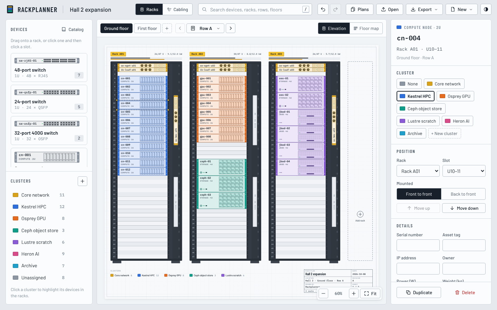
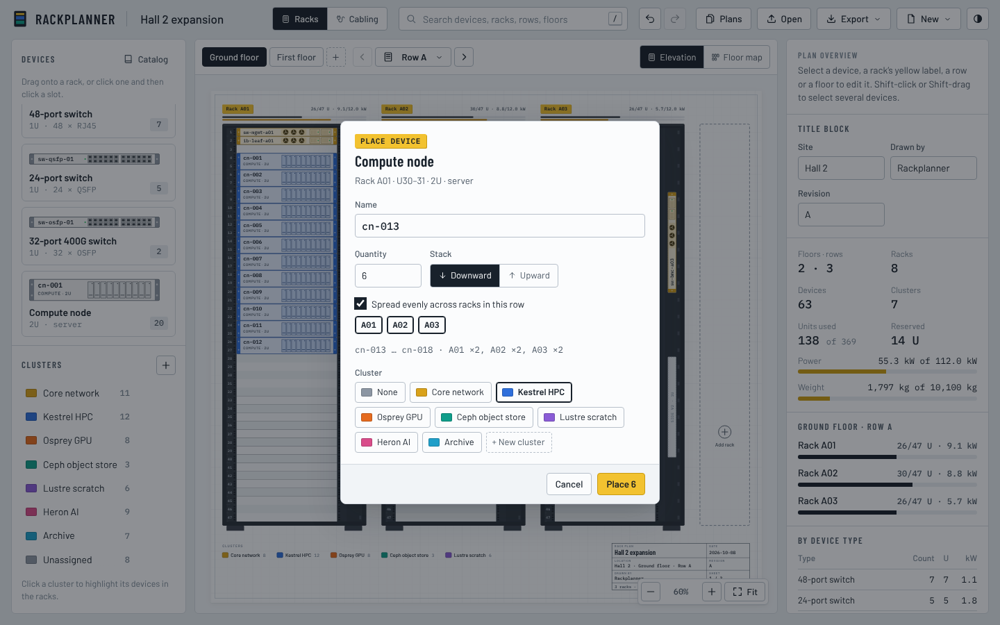
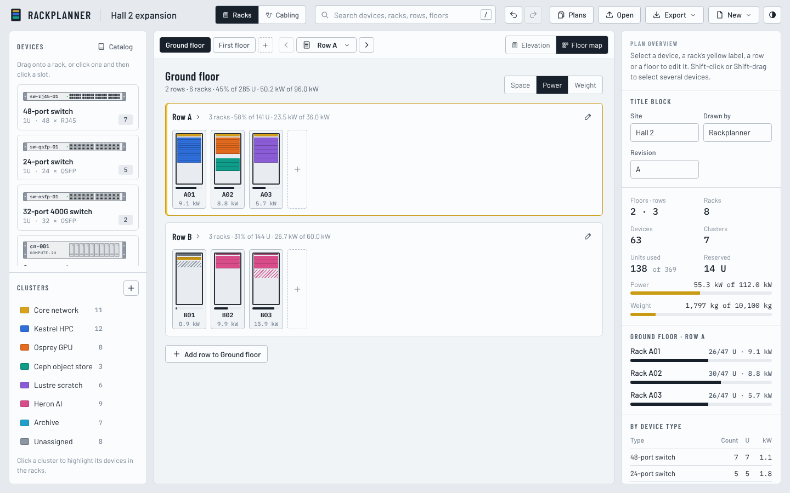
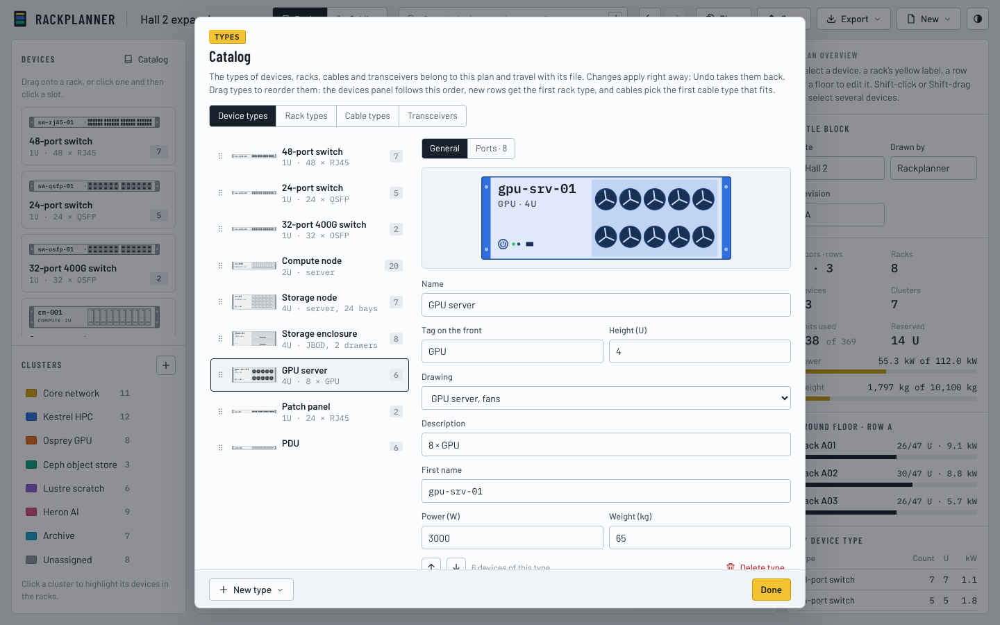
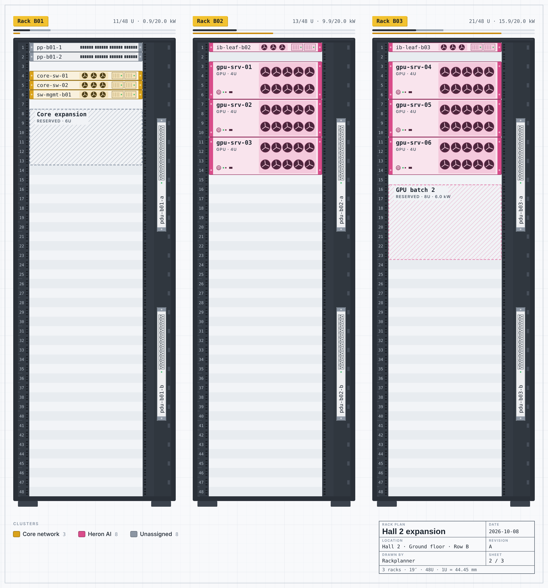
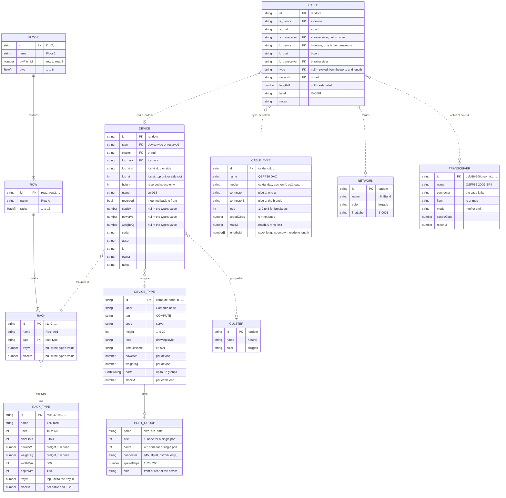

# Rackplanner

<a href="https://dennisklein.github.io/rackplanner/media/">
  <picture>
    <source media="(prefers-color-scheme: dark)" srcset="docs/screenshots/intro-video-dark.png">
    
  </picture>
</a>

<picture>
  <source media="(prefers-color-scheme: dark)" srcset="docs/screenshots/elevation-dark.png">
  
</picture>

A single-page app for planning datacenter rack layouts, right in the browser.
Racks stand in rows, rows on floors, and each row is drawn in elevation view as
a schematic drawing sheet. You place switches, servers, storage and anything
else from a catalog you can extend, and track space, power and weight against
each rack's budget. Devices get their own names and belong to color-coded
clusters, so the equipment that works together stands out.

Device types have ports, and the **Cabling** workspace connects them: cables
from port to port, in networks with their own colors and labels, with
lengths estimated from where the racks stand. It shows the racks from the
rear with every cable run, each switch's ports, a cable schedule with the
list of what to order, and the fabric of each network.

**[Open Rackplanner](https://dennisklein.github.io/rackplanner/)**: it starts
with an example plan of two floors, which you can explore, keep editing or
swap for empty racks. It works with a mouse, the keyboard or touch, in a
light or dark theme.

There is no server and no build step: plain HTML, CSS and JavaScript. Plans are
saved in your browser and never uploaded; they work offline and can be
exported as files or shared as links.

Public domain under CC0 1.0: use it for anything, no strings attached. See [License](#license).

## Running it yourself

The [live version](https://dennisklein.github.io/rackplanner/) needs nothing
installed. To run your own copy, open `index.html` in a browser. It also works
from `file://`, except that there is no offline cache and share links point at
the file on your own disk.

Or serve the folder with any static web server:

```sh
npm start            # http://localhost:8080 via http-server
python3 -m http.server
```

It runs as is on any static host.

## What you can plan

| Level | Limits |
| --- | --- |
| Floors | 1 to 6 per plan |
| Rows | 1 to 8 per floor |
| Racks | 1 to 16 per row, 19″, 10U to 60U high, numbered from the top (U1) down |
| Side slots | 0 to 4 vertical 1U slots per rack, on the right, depending on its height |

Every rack has a **rack type**: its height, number of side slots, power budget
and maximum load. New plans come with a 47U rack (the default, 12 kW, 1200 kg),
a 42U rack and a 48U high-density rack. For cable lengths a rack type also
has a width and depth (600 or 800 mm by 1200 mm), the way from its top unit
up to the cable tray (0.5 m) and the slack a cable gets at each end
(0.25 m); a rack can set its own tray distance and slack.

**Device types** come from the plan's catalog. New plans start with these:

| Device | Height | Front | Ports |
| --- | --- | --- | --- |
| 48-port switch | 1U | 48 × RJ45 | `swp1`–`swp48` RJ45 1G, `swp49`–`swp52` SFP+ 10G, at the front |
| 24-port switch | 1U | 24 × QSFP | `p1`–`p24` QSFP56 200G, at the front |
| Compute node | 2U | server, drive bays | `bmc` and `eth0` RJ45, `ib0` QSFP56, at the rear |
| Storage node | 4U | server, 24 × 3.5″ bays | `bmc`, `eth0` RJ45, `eth1` SFP28, `ib0`–`ib1` QSFP56, `sas0`–`sas3` Mini-SAS HD, at the rear |
| Storage enclosure | 4U | JBOD, 2 drawers | `mgmt` RJ45, `sas-a` and `sas-b` Mini-SAS HD, at the rear |

The catalog editor adds more, from templates (1U server, GPU server, patch
panel, PDU, UPS, blanking panel, generic device) or from scratch: pick a
name, height (1U to 20U), a drawing style, typical power draw and weight,
and on the **Ports** tab its ports.
**Reserved space** is always available too: a hatched placeholder of any height
that keeps units free for planned equipment and can carry the power it will draw.

The side slots take 1U devices only. Devices there are drawn rotated, which
makes a 1U PDU look like a vertical power strip.

A device can be mounted **back to front**, as switches often are so that
their ports face the servers' rear. The rack then shows its rear side, with
its fans or power supplies, and its front ports are at the rack's rear.

## Using it



- **Place**: drag a device from the left panel onto a rack, or click it and
  then click a free slot (on a touch screen, tap it and then tap a slot). A
  green outline means it fits; red explains the conflict.
- **Name and cluster**: the placement dialog asks for a name and a cluster
  (a named color). It suggests both from the nearest device of the same type,
  so dropping a node next to `cn-012` offers `cn-013` in the same cluster.
  You can create a new cluster with its own color right there.
- **Several at once**: set a quantity to stack devices downward or upward from
  the drop point. Occupied units are skipped and names count up (`cn-013 … cn-020`).
  Tick **Spread evenly across racks in this row** and pick the racks to share
  them out; a rack that runs out of space leaves the rest to the others.
- **Move**: drag devices between units, racks and side slots. Hold <kbd>Alt</kbd>
  while dropping to copy instead.
- **Edit a device**: select it to rename it, change its cluster, move it to any
  rack in the plan, mount it front to front or back to front, and fill in
  its serial number, asset tag, IP address, owner and notes. Power and
  weight come from its type unless you enter its own values.
- **Select several**: <kbd>Shift</kbd>-click devices, <kbd>Shift</kbd>-drag
  across the empty sheet, press <kbd>Ctrl</kbd>+<kbd>A</kbd> for the whole row,
  or use the select buttons on a rack, row or cluster. Then move them
  together (drag, or the arrow keys), duplicate them, give them one cluster
  or owner, mount them back to front, rename them in series or delete them.
- **Duplicate**: <kbd>Ctrl</kbd>+<kbd>D</kbd> (or the Duplicate button) copies
  whatever is selected. A device or a group of devices is copied into the
  nearest free space, below it first, then above, then in the neighbouring
  racks, keeping the group's layout; names continue each series (`cn-013`,
  `cn-014`). A rack, row or floor is copied with all its devices and
  inserted right after the original.
- **Clusters**: click one in the left panel to highlight its devices. Use the
  pencil icon to rename or recolor it.
- **Move around**: the bar above the drawing has a tab per floor, the row
  picker with previous and next buttons, and a switch between the
  **Elevation** of the current row and the **Floor map**. The floor map shows
  every row of a floor with a small drawing of each rack and a meter for
  space, power or weight; click a rack to open it, a row name to see its
  elevation.
- **Search**: type in the search box (or press <kbd>/</kbd>) to find floors,
  rows, racks and devices. Devices are found by name, type, cluster, serial
  number, asset tag, IP address or owner. Pick a result to jump there. While
  the search is on, matching devices stay highlighted in the drawing and
  marked on the floor map.
- **Racks, rows and floors**: click a rack's yellow label to rename it, change
  its type, move it left or right, insert a rack beside it, duplicate it,
  move it to another row or delete it. The dashed **Add rack** slot at the end
  of a row adds one. Row and floor settings (from the row picker, the pencil
  on the floor map, or a click on the active floor tab) rename, reorder, move
  and delete them, and show their totals.
- **Catalog**: the **Catalog** button above the devices edits device types,
  rack types, cable types and transceivers. Changes apply at once and are
  checked: a type can't grow if its devices would then overlap or stick out
  of their racks. Drag types by their
  grip to reorder them (or use the arrow buttons, or <kbd>Alt</kbd>+<kbd>↑</kbd>
  <kbd>↓</kbd>): the devices panel shows device types in this order, racks
  in new rows get the first rack type, and cables pick the first cable type
  that fits.
- **Power and weight**: rack labels show units and kW used; a second bar fills
  toward the power budget and turns red, with a “!”, when a rack is over its
  power or weight budget. The inspector shows the numbers for a rack, row,
  floor or the whole plan.
- **Theme**: the button at the right end of the toolbar picks **Light**,
  **Dark** or **Match system**, which follows your device's setting (the
  default). The choice is remembered in this browser. Exported images and
  printouts always use the light theme.
- **Undo** everything with <kbd>Ctrl</kbd>+<kbd>Z</kbd>, redo with
  <kbd>Ctrl</kbd>+<kbd>Shift</kbd>+<kbd>Z</kbd> or <kbd>Ctrl</kbd>+<kbd>Y</kbd>.

<p>
  
  
</p>

| Shortcut | Action |
| --- | --- |
| <kbd>/</kbd> or <kbd>Ctrl</kbd>+<kbd>K</kbd> | Search |
| <kbd>[</kbd> <kbd>]</kbd> | Previous, next row |
| <kbd>C</kbd> | Racks or Cabling workspace |
| <kbd>M</kbd> | Floor map on or off (Racks) |
| <kbd>↑</kbd> <kbd>↓</kbd> | Move the selected devices to the next free position (Racks) |
| <kbd>←</kbd> <kbd>→</kbd> | Move them to the neighbouring rack (Racks) |
| <kbd>Shift</kbd>+click, <kbd>Shift</kbd>+drag | Add to the selection, select an area; in Cabling, add or remove a cable, or in the schedule select a range of cables |
| <kbd>Ctrl</kbd>+click | In Cabling, add or remove a cable |
| <kbd>Ctrl</kbd>+<kbd>A</kbd> | Select every device in the row; in Cabling, the cables shown |
| <kbd>Ctrl</kbd>+<kbd>D</kbd> | Duplicate the selected devices, rack, row or floor (Racks) |
| <kbd>Enter</kbd> or <kbd>F2</kbd> | Rename the selected device; in Cabling, edit the selected cable's label |
| <kbd>Del</kbd> | Delete; in Cabling, delete the selected cables or unplug the selected port |
| <kbd>Tab</kbd> | Walk through devices, top to bottom (Racks) |
| <kbd>Ctrl</kbd>+<kbd>Z</kbd>, <kbd>Ctrl</kbd>+<kbd>Shift</kbd>+<kbd>Z</kbd> | Undo, redo |
| <kbd>0</kbd> / <kbd>1</kbd> / <kbd>+</kbd> / <kbd>−</kbd> | Fit sheet / 100% / zoom |
| <kbd>Ctrl</kbd>+scroll | Zoom at the pointer |
| <kbd>Enter</kbd> or <kbd>Esc</kbd> | In Cabling, connect a breakout cable with the legs set so far |
| <kbd>Esc</kbd> | Cancel placing, dragging or connecting, deselect, clear the search; in Cabling, show all networks again |

On a Mac, use <kbd>⌘</kbd> for <kbd>Ctrl</kbd>. Drag the empty sheet to pan.
In Cabling, the zoom keys work in the elevation and the fabric.

## Planning the cabling

<picture>
  <source media="(prefers-color-scheme: dark)" srcset="docs/screenshots/cabling-elevation-dark.png">
  
</picture>

The **Racks | Cabling** switch in the top bar (or <kbd>C</kbd>) changes the
workspace. The floor tabs and the row picker stay; the left panel lists cable
types and networks instead of devices and clusters, and the bar above the
drawing switches between four views:

- **Elevation**: the row from the **Rear** (the default, with the racks
  running right to left) or the **Front**. Every device shows the ports on
  that side, cabled ones in their network's color. Cables run from the port
  into the rack's cable manager (copper on the left, fiber and direct cables
  on the right), up to the tray above the racks and along it, and to an exit
  at the end of the tray for cables to other rows and floors; click an exit
  to go there. A selected device, port or cable is drawn bold, with the far
  ends named.
- **Port map**: the faceplates of a rack's **Switches**, or of **All
  devices**, drawn large: every port numbered and colored by network, with
  the device at the other end written above or below it and a dot when that
  is in another rack. Step from rack to rack with the arrows.
- **Schedule**: every cable as a table, for the row, the floor or the plan,
  grouped by route, network, device or cable type, in groups that fold.
  Filter it by text and by network, select cables with the checkboxes (or
  <kbd>Shift</kbd>- and <kbd>Ctrl</kbd>-click), and edit them together. The
  list of what to order is underneath.
- **Fabric**: one network of the whole plan as a graph of core switches,
  leaves and nodes. Nodes on the same leaves, of the same cluster and type,
  are drawn as one box (**Grouped**), or each on its own (**Every device**).
  Each leaf shows its ports in use and its oversubscription, down links to
  up links, red above 3 : 1. Click a switch to see its links and the
  fabric's checks, a box to list its nodes.

<p>
  
  
</p>

**Connecting**: click a free port and then another, or drag from one to the
other, in the elevation or the port map (on a touch screen, tap one and then
the other). The cable type picked in the left panel is used; **Auto**, the
default, picks the first type in the catalog that fits both ports and
reaches the length. For a breakout cable (one head, 2 to 8 legs), pick its
type, click the head's port and then a port for each leg; <kbd>Enter</kbd>
or <kbd>Esc</kbd> connects it with the legs set so far. Before that,
<kbd>Esc</kbd> cancels. **+ Cable** in the schedule connects two ports
picked from lists, and so does a free port's inspector, or **Connect…**
beside a free port in a device's inspector.

**Connect series** (in the schedule, on each faceplate of the port map, and
in the inspector of a device or of several) joins many devices to one
device at once: say `cn-001 … cn-012`, the port on each (`ib0`), the device
to connect them to and its first port. Each device gets the next free port,
top to bottom, every *step* ports. The dialog also sets the network, the
cable type and the first label; a breakout type takes as many devices per
port as it has legs. The preview lists every cable with its type and
length, and the devices it leaves out and why: a port already in use, or no
free port left that a cable joins to theirs (an RJ45 series stops at a
switch's SFP+ cages). Nothing is connected until you confirm.

<p>
  
  
</p>

- **Cable types** say what can be bought: the plug at each end, the number
  of legs, the speed, the reach and the **stock lengths**. A type without
  stock lengths is **made to length**: its cables get the length they need.
  New plans have Cat6a patch cords, SFP28 and QSFP56 DAC, QSFP56 AOC, OSFP to
  2 × QSFP56 DAC and AOC breakouts, LC and MPO fiber and Mini-SAS HD cables;
  **New type** in the catalog adds another from one of these, or copies the
  type selected.
- **Transceivers** let fiber cables plug into SFP, QSFP, QSFP-DD and OSFP
  cages. A fiber cable gets a transceiver at each cage that fits it, picked
  from the catalog like the cable type, or one chosen in the cable's
  inspector.
- **Networks** color cables the way clusters color devices, and label them:
  new cables continue the network's series (`IB-0001`, `IB-0002`, …), and
  cables without a network continue `C-0001`. Click a network in the left
  panel to show only its cables; new cables join it (otherwise they get the
  network used last). Every label can be changed by hand, and **Renumber**
  relabels selected cables in the schedule's order.
- **Inspector**: select a cable to change its label, network, type,
  transceivers, length and notes, or to plug in or unplug the legs of a
  breakout cable; a device to see each port and where it goes, mount it
  back to front, set its slack and unplug them all (**Unplug all**); a port
  to see its cable, or to connect it. With nothing selected it sums up the
  row's cabling, lists what to check, shows the ports in use per rack and
  sets the floor's row pitch.
- **Search**, in Cabling, finds cables too, by label, ends, network, cable
  type and notes, and highlights them in the drawings.

**Lengths** are estimated from the way a cable runs. Within a rack it is the
height between the two ports, plus the rack's depth when one faces the front
and the other the rear. Otherwise both ends go up to the top of their rack
and on to the tray, then along it: the racks' widths along the row, and the
floor's **Row pitch** (3 m unless set in the floor's settings, or in Cabling
with nothing selected) for each step from one end's row to the other's.
Each end adds its rack's slack and its device's slack. The cable's
length is that rounded up to the type's next stock length, or to 0.1 m for
a type made to length. Estimated lengths are in italics; type a length into
the cable's inspector to decide it. Cables between floors are not estimated:
enter their length by hand.

**To order**, under the schedule, counts the cables of each type by stock
length, lists every length of the types made to length with their total, and
counts the transceivers, for all the cables of the row, floor or plan the
schedule shows, whatever its filters.

**Checks** flag what needs a look, in the schedule's Check column, the
cable's inspector and the **To check** list of the row: a plug that doesn't
fit, missing optics or a transceiver that doesn't fit, a cable that runs
slower than one of its ports (a note), a cable too long for its type or
transceivers, a length beyond the longest stock length, a length set shorter
than the cable needs, no cable type that fits, a cable between floors
without a length, and a label used twice. The plan never holds a second
cable on a port, or a cable to a port that doesn't exist.

<p>
  
</p>

A device type's ports are written as patterns on the catalog's **Ports**
tab: `swp[1-48]`, `Ethernet1/[1-32]`, `[1-24]`, or a single `bmc`, each with
its connector, speed and side (**Copy ports from…** takes another type's),
and the slack per cable at its devices. A device mounted back to front has
its front ports at the rack's rear. A change that would unplug cables names
them before it applies, and moving or reversing a device keeps its cables
plugged in.

## Saving, sharing and exporting

Plans are saved in the browser's `localStorage` as you work. **Plans** lists
every plan in this browser to open, duplicate or delete; **New** starts an
empty plan, one with the current layout but no devices, or the example.
Plans saved by earlier versions are moved into the list automatically.

**Export** offers:

- **PNG image** and **SVG drawing** of the current row, with cluster legend and
  title block, always in the light theme. In Cabling they give the cabling
  elevation from the side shown, or the fabric of the network shown (from
  the port map or the schedule, the row's Racks sheet).
- **Print or PDF**: one sheet per row, for the current row, floor or the whole
  plan, on A4, A3, Letter, Legal or Tabloid, with its **Racks** or its
  cabling (**Cabling front**, **Cabling rear**). The title block names the site,
  floor and row, author, revision, date and sheet number; fill these in on the
  plan overview (click the empty sheet to see it).
- **CSV inventory** of every device with floor, row, rack, position, type,
  cluster, serial number, asset tag, IP address, owner, power, weight and notes.
- **Cable schedule (CSV)**: one line per cable of the plan, and per leg of a
  breakout cable, with label, network, type, length and whether it is
  estimated, both ends with floor, row, rack, position, device, port and
  transceiver, speed, checks and notes.
- **Cable order list (CSV)**: the plan's cables by type and length, with
  counts and totals, and the transceivers. The schedule's **Order list
  (CSV)** and **Cable schedule (CSV)** buttons give the same for the row,
  floor or plan it shows, whatever its filters.
- **Plan file (.json)**, which **Open** reads back as a new plan. You can also
  copy the plan as JSON and paste it into Open on another machine.
- **Share link**: the whole plan, compressed into the link itself. Whoever opens
  it gets their own copy in their browser; nothing is uploaded. Very large
  plans make long links, so send the file instead if a chat program cuts it off.

<p align="center">
  <a href="docs/screenshots/sheet.png"></a>
  <br><em>Row B of the example, exported as a PNG</em>
</p>

**Open** also imports a **CSV inventory**, into a new plan or added to the
current one. It needs Rack, Position (`U12`, `U12-13` or `Side V1`) and Name or
Type columns; Floor, Row, Height, Cluster and the other columns of the export
are used when present. Missing floors, rows, racks and clusters are created by
name, and unknown types become generic types of the given height. Comma,
semicolon and tab separators all work.

**Open** also reads a **cable schedule CSV**, like the export or made by
hand, and adds its cables to the current plan. It needs A device, A port,
B device and B port columns; devices are found by name, told apart by the
floor, row, rack and position given when two share a name. A plain Length
column holds metres; a length it cannot read is estimated. Networks it
names are created, and the lines of a breakout cable (with a Leg like `1/2`,
or a breakout cable type) share its label and A end.

Imported files are checked: devices that overlap or don't fit are skipped, and
everything that needed fixing is listed after the import.

## Offline and installing

The fonts are part of the app, and a service worker keeps a copy of all files,
so once the site has been opened it also works without a network. New
versions are picked up on the next visit while online. Browsers that install
web apps (Install or Add to Home Screen in their menu) can install it to run
in its own window.

## Project layout

```
index.html           page shell, icons and dialogs
css/app.css          styles, light and dark themes, print layout
css/cabling.css      styles of the Cabling workspace
css/fonts.css        the bundled web fonts
fonts/               Barlow, Barlow Condensed, IBM Plex Mono (SIL OFL 1.1)
js/model.js          data model: floors, rows, racks, catalogs, ports, cables, placement rules, stats, search
js/cabling.js        connecting ports, cable lengths, picking cable types and transceivers, checks, order list, fabric
js/io.js             plan files (all versions), CSV export and import, cable schedule CSV, share links
js/render.js         SVG drawing of a row, device fronts and rears, sheet geometry, hit testing
js/cabling-render.js SVG drawing of the cabling elevation, the port map and the fabric
js/library.js        plans saved in the browser
js/cabling-ui.js     the Cabling workspace: its panel, views, inspectors, connecting and dialogs
js/app.js            UI state, undo history, navigation, drag and drop, dialogs, export
sw.js                service worker for offline use
manifest.webmanifest, icon.svg   installable web app
test/                unit tests for model, io, library, renderers and cabling
e2e/                 browser tests (Playwright) and their static server
docs/                README screenshots and the script that takes them
docs/cabling/        the design of the cabling
media/               the intro video: its animation, player page and the script that records it
```

`model.js`, `cabling.js`, `io.js`, `render.js`, `cabling-render.js` and
`library.js` have no DOM access and run in Node as well as in the browser.

## Data model

A plan is one JSON document, and a plan file is that document as is. Floors
hold rows and rows hold racks as nested arrays. Devices, cables, the four
catalogs, clusters and networks are flat lists at the top level and point at
each other by id.



Solid lines are arrays nested in their parent, dashed lines are ids. The three
`loc_` fields are one object in the file, for example
`"loc": { "rack": "r1", "kind": "u", "at": 5 }`, and a cable's ends are the
objects `a` and `b`. Besides the nine lists (`floors`, `rackTypes`,
`deviceTypes`, `cableTypes`, `transceivers`, `clusters`, `networks`,
`devices`, `cables`), the top level holds `app` (`"rackplanner"`),
`version` (4), the plan's `name`, `info` with the site, author and revision
for the title block, and `meta`. A plan has 1 to 6 floors, 1 to 20 rack
types, up to 60 device types, 50 cable types, 50 transceivers, 30 networks
and 20 000 cables. A device type has up to 32 port groups and 1024 ports. A
device's `reversed` and `slackM` are left out of the file while they are
`false` and `null`.

Where a device sits:

- With `"kind": "u"`, `at` is the topmost unit the device fills. Units count
  from the top, so a 2U device at 5 fills U5 and U6. It must stay within the
  rack type's units and may not overlap another device.
- With `"kind": "side"`, `at` is a side slot, counted from 0 at the top (V1 in
  the app). Each slot holds one 1U device. A slot runs along 12U plus a 1U gap,
  so a rack type has at most (units − 1) / 13 side slots, rounded down, and
  never more than 4.
- Reserved space has the built-in type `reserved`, which is not stored in
  `deviceTypes`. Each reservation stores its own `height`. It counts as 0 W
  and 0 kg unless it has its own `powerW` or `weightKg`, such as the power
  booked for equipment still to come.

A port group with `first` and `count` is a numbered series (`swp` 1 to 48 is
`swp1` … `swp48`), one with neither is a single port named `name`. Port names
are unique within a type, and cables name their ports. `side` is the side of
the device, so a reversed device has its front ports at the rack's rear.

```json
"ports": [
  { "name": "swp", "first": 1, "count": 48, "connector": "rj45", "speedGbps": 1, "side": "front" },
  { "name": "mgmt0", "connector": "rj45", "speedGbps": 1, "side": "rear" }
]
```

A cable's `a` end is one port. Its `b` end is one port too, or for a
breakout cable (a type with 2 to 8 `legs`) a list of one end per leg, with
`null` for a leg not plugged in; `a` is then the head. An end's
`transceiver` is absent or `null` to have one picked, or the id of the
transceiver chosen. `type: null` picks the cable type from the ports and the
length; a breakout cable names its type. `lengthM: null` estimates the
length.

```json
"cables": [
  { "id": "cb-1", "type": null, "network": "n-mgmt", "label": "MGT-0001", "lengthM": null, "notes": "",
    "a": { "device": "ex-9", "port": "eth0" }, "b": { "device": "ex-1", "port": "swp1" } },
  { "id": "cb-113", "type": "dac-osfp-2x", "network": "n-ib", "label": "IB-0043", "lengthM": null, "notes": "",
    "a": { "device": "ex-50", "port": "p1" },
    "b": [{ "device": "ex-52", "port": "ib0" }, { "device": "ex-52", "port": "ib1" }] }
]
```

A plan never holds an end on a device or port that does not exist, a second
cable on a port, the same port twice in a cable, a cable from a device to
itself (the legs of a breakout may share a device, but not with the head), or
a cable type or transceiver that is not in the catalog. Imports drop such
cables with a warning.

Floors, rows and racks share one id space, so an id names only one of them.
New ones get the next free `f1`, `row1` or `r1`, new catalog types `t1`,
`rt1`, `ct1` or `tr1`. Device, cluster, network and cable ids are random.
Cluster ids starting with `__` are reserved for the app and replaced on
import.

What a change does to the rest of the plan:

| Change | Effect |
| --- | --- |
| Deleting a floor, row or rack | Deletes the devices in it and their cables. A plan keeps at least one floor, a floor one row, a row one rack. |
| Deleting a device type | Deletes its devices and their cables. |
| Deleting a device | Deletes its cables. A breakout cable only loses its legs there, unless it has none left or loses its head. |
| Deleting a rack type | Refused while a rack uses it. The last rack type always stays. |
| Deleting a cable type or transceiver | Refused while a cable names it. |
| Deleting a cluster | Its devices stay where they are, without a cluster. |
| Deleting a network | Its cables stay, without a network. |
| Moving or reversing a device | Its cables stay plugged in; estimated lengths follow. |
| Duplicating devices, a rack, a row or a floor | Cables between the copied devices are copied, with labels that continue their series. |
| Changing a type's ports | Ports keep their cables by group and place in the group; the catalog names the cables a change would unplug before it applies. |
| A new plan from this layout | No devices, so no cables or networks; the catalogs stay. |

**Open** reads plan files of every version. Version 1 counted units from the
bottom, and versions 1 and 2 had a single list of racks, which becomes one row.
Versions 1 to 3 had no ports or cables: their standard device types and rack
types get the standard ports, sizes, tray distance and slack, and the plan
gets the standard cable types and transceivers and no networks or cables.

## Tests

```sh
npm test             # unit tests: placement, catalogs, cabling, import, CSV, drawing (no dependencies)
npm ci               # once, for the browser tests and screenshots
npm run test:e2e     # browser tests: drive the app in Chromium via Playwright
npm run screenshots  # retake the README screenshots and the intro video banner
npm run video        # record the intro video and its poster into media/ (needs ffmpeg)
```

The unit tests use Node's built-in test runner (Node 18 or later). The browser
tests in `e2e/` start a small static server and cover dragging, placing and
spreading, navigation and search, the floor map, the catalog editor, rack
types and budgets, selecting and moving several devices, reserved space, the
plan list, share links, CSV and plan file import, printing, exports, offline
caching, the theme switch, the panel layout and the phone layout, and in
the Cabling workspace connecting ports by clicks and drags, breakout cables,
Connect series, the cable inspector, networks and labels, the schedule and
its order list, the elevation from both sides, the port map, the fabric,
cable schedule export and import, the ports, cable type and transceiver
catalogs, devices mounted back to front and the length settings. If Chromium
is missing, install it with `npx playwright install chromium`. The app itself
has no dependencies; Playwright is only needed for these tests and the
screenshots.

## Deployment

Every push to `main` runs the unit and browser tests and, if they pass,
publishes the site to [GitHub Pages](https://dennisklein.github.io/rackplanner/)
(see `.github/workflows/pages.yml`). You can also start a deployment by hand
from the Actions tab.

Alongside the tests, a second job records the intro video (`npm run video`) as
MP4 and WebM, which the deployment publishes with its
[player page](https://dennisklein.github.io/rackplanner/media/). The recording
is cached and only made again when the video's sources, the drawing code or
the fonts change. The rendered files are not kept in git.

To deploy a fork of your own, set **Settings → Pages → Build and deployment →
Source** to **GitHub Actions** once. The `github-pages` environment only takes
deployments from the default branch, so keep that `main` or allow other
branches under **Settings → Environments → github-pages**. Pages for a private
repository needs a paid GitHub plan.

## License

[](https://creativecommons.org/publicdomain/zero/1.0/)

Rackplanner is dedicated to the public domain under
[CC0 1.0 Universal](https://creativecommons.org/publicdomain/zero/1.0/).
To the extent possible under law, the authors have waived all copyright and
related rights to this work. You can copy, modify, distribute and use it, even
commercially, without asking permission or giving credit. The full legal text
is in [LICENSE](LICENSE).

The bundled fonts in `fonts/` are not part of that dedication: Barlow, Barlow
Condensed and IBM Plex Mono are licensed under the SIL Open Font License 1.1,
see [fonts/OFL.txt](fonts/OFL.txt).
