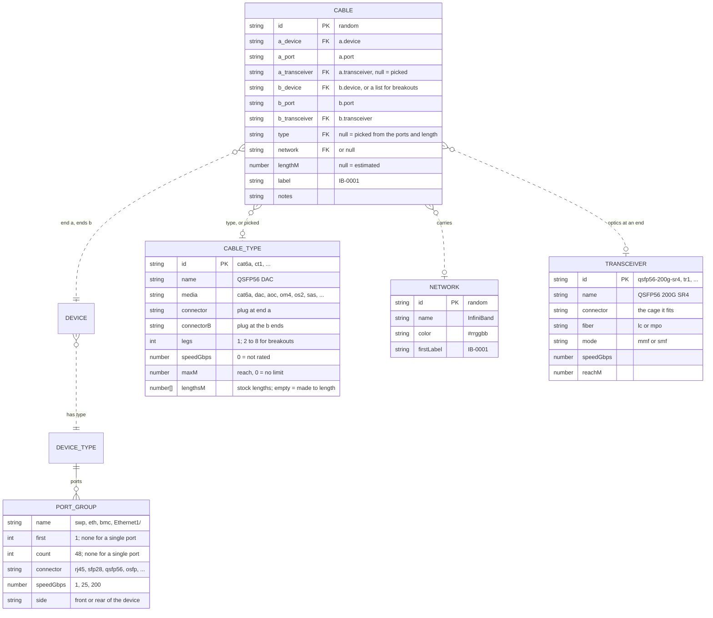
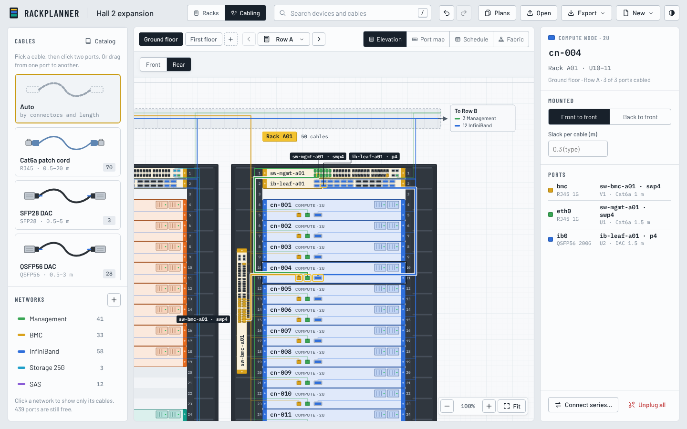
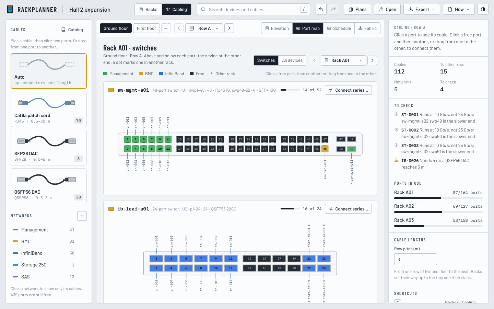
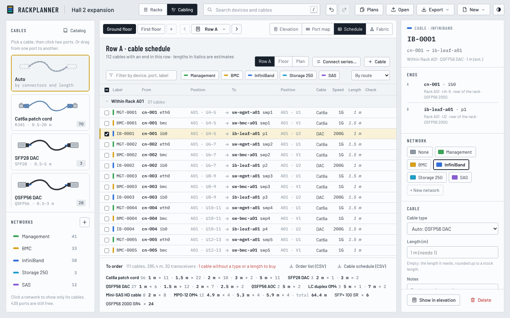
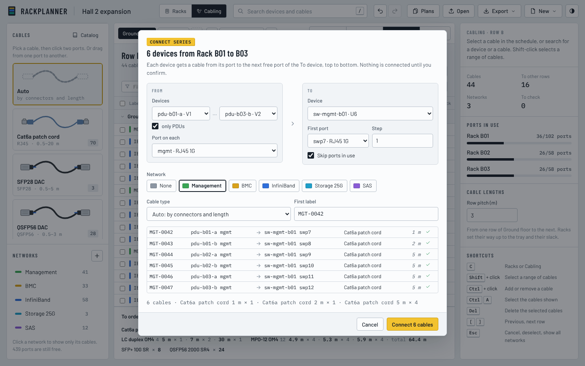
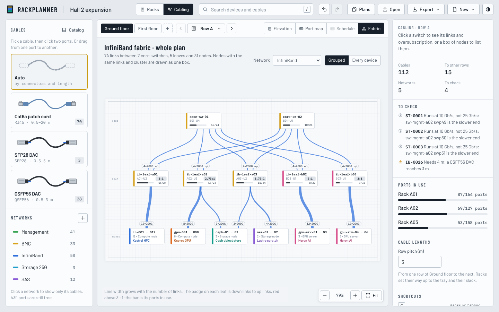
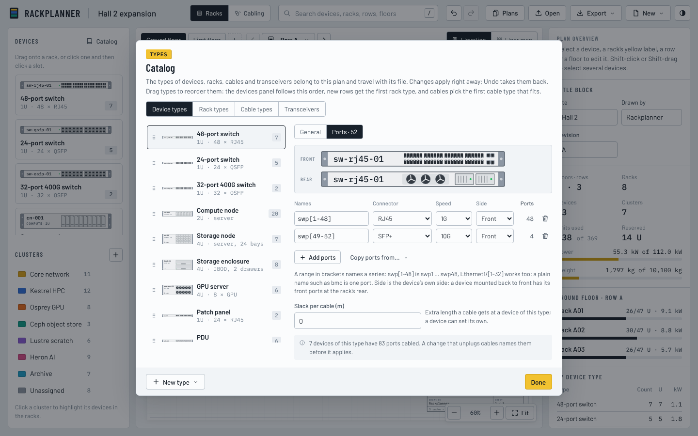

# Cabling: design

Rackplanner plans the physical network cabling of a plan in its own
**Cabling** workspace, next to the **Racks** workspace that places devices.
Device types get named **ports** with a connector and a speed; **cables**
join two ports, or one port to several in the case of breakout cables;
**transceivers** and fiber join cages that need optics; **networks** color
cables the way clusters color devices; and two catalogs, **cable types** and
**transceivers**, say what can be bought, in which lengths.

This document is the design the implementation follows. It started as a
proposal; the decisions taken on it are recorded at the end. The screenshots
show the views as they are built, on the example plan; the
[README](../../README.md#planning-the-cabling) says how to use them.

## 1. Data model

Plan files are version 4. Everything new is optional when reading: older
files open with no ports beyond those of the standard types, no cables, no
networks, and the default cable types and transceivers.

| Addition | Where | Like the existing |
| --- | --- | --- |
| `ports`, `slackM` | each device type | `height`, `powerW` |
| `reversed`, `slackM` | each device | `powerW` (`null` = the type's) |
| `widthMm`, `depthMm`, `trayM`, `slackM` | each rack type | `units`, `powerW` |
| `trayM`, `slackM` | each rack, `null` = the rack type's | a device's `powerW` |
| `rowPitchM` | each floor | |
| `networks` | top-level list | `clusters` |
| `cableTypes`, `transceivers` | top-level catalogs | `rackTypes` |
| `cables` | top-level list | `devices` |



### Ports

A device type lists its ports in groups. A group with `first` and `count` is
a numbered series; a group with neither is one port named `name`.

```json
"ports": [
  { "name": "swp", "first": 1,  "count": 48, "connector": "rj45", "speedGbps": 1,  "side": "front" },
  { "name": "swp", "first": 49, "count": 4,  "connector": "sfp+", "speedGbps": 10, "side": "front" },
  { "name": "mgmt0", "connector": "rj45", "speedGbps": 1, "side": "rear" }
]
```

- Names are unique within a type; cables refer to a port by its name.
- `first` without `count` is one numbered port, `count` without `first`
  counts from 1. `name` may be empty for a series (`1` … `24`).
- `side` is the side of the **device**. A device mounted back to front
  (`reversed`) has its front ports at the rack's rear.
- In the catalog a group is written as a pattern: `swp[1-48]`,
  `Ethernet1/[1-32]`, `[1-24]` or `bmc`.
- At most 32 groups and 1024 ports per type.

Connectors, each with a family that decides what plugs into what:

| Family | Connectors (usual speed) |
| --- | --- |
| RJ45 | `rj45` (1G) |
| SFP | `sfp` (1G), `sfp+` (10G), `sfp28` (25G), `sfp56` (50G) |
| QSFP | `qsfp+` (40G), `qsfp28` (100G), `qsfp56` (200G), `qsfp112` (400G) |
| QSFP-DD | `qsfp-dd` (400G); its cages also take QSFP plugs |
| OSFP | `osfp` (800G) |
| Fiber | `lc` (LC duplex), `mpo` (MPO) |
| SAS | `sas-hd` (Mini-SAS HD, 12G) |

SFP, QSFP, QSFP-DD and OSFP ports are **cages**: they take a DAC or AOC plug
of their family, or a transceiver that fits them.

### Cable types and transceivers

```json
{ "id": "dac-qsfp56", "name": "QSFP56 DAC", "media": "dac", "connector": "qsfp56", "connectorB": "qsfp56",
  "legs": 1, "speedGbps": 200, "maxM": 3, "lengthsM": [0.5, 1, 1.5, 2, 2.5, 3] }
{ "id": "mpo-om4", "name": "MPO-12 OM4", "media": "om4", "connector": "mpo", "connectorB": "mpo",
  "legs": 1, "speedGbps": 0, "maxM": 0, "lengthsM": [] }
{ "id": "dac-osfp-2x", "name": "OSFP to 2 × QSFP56 DAC", "media": "dac", "connector": "osfp", "connectorB": "qsfp56",
  "legs": 2, "speedGbps": 400, "maxM": 3, "lengthsM": [1, 1.5, 2, 2.5, 3] }
{ "id": "qsfp56-200g-sr4", "name": "QSFP56 200G SR4", "connector": "qsfp56", "fiber": "mpo", "mode": "mmf",
  "speedGbps": 200, "reachM": 100 }
```

- **Media**: copper patch cords (`cat6`, `cat6a`, `cat8`) plug into RJ45;
  direct cables (`dac`, `aoc`, `sas`) plug into cages or SAS ports;
  fiber (`om3`, `om4`, `om5` multimode, `os2` single-mode) has LC or MPO
  plugs and needs a transceiver at every cage, or a fiber port.
- **Breakout** cable types have `legs` from 2 to 8: end `a` is the head with
  plug `connector`, the `b` ends are the legs with plug `connectorB`.
- **Stock lengths** are what can be bought. A type without stock lengths is
  **made to length**: its cables get the length they need, and the order
  list shows those lengths, so the lengths to buy can be decided once the
  cabling is planned.
- `maxM` is the reach of a direct or copper cable; for fiber the
  transceivers' `reachM` counts.
- At most 50 cable types and 50 transceivers.

### Networks

`{ id, name, color, firstLabel }`. New cables of a network are labeled by
continuing its series from `firstLabel` (`IB-0001`, `IB-0002`, …), past the
highest label of that series in the plan. Every label can be changed by
hand; labels used twice are flagged. Cables without a network continue
`C-0001`. At most 30 networks.

### Cables

```json
{ "id": "cb-x1", "type": null, "network": "n-ib", "label": "IB-0001", "lengthM": null, "notes": "",
  "a": { "device": "ex-9", "port": "ib0" }, "b": { "device": "ex-2", "port": "p1" } }
{ "id": "cb-x2", "type": "dac-osfp-2x", "network": "n-ib", "label": "IB-0043", "lengthM": null, "notes": "",
  "a": { "device": "ex-50", "port": "p1" },
  "b": [{ "device": "ex-52", "port": "ib0" }, { "device": "ex-52", "port": "ib1" }] }
```

- `type: null` picks the type from the two ports and the length (below);
  only single cables can be picked, breakouts name their type.
- A breakout's `b` is a list of `legs` ends; unused legs are `null`.
- An end's `transceiver` is `null` or absent to have it picked, or a
  transceiver id; it only matters where a fiber cable meets a cage.
- `lengthM: null` estimates the length; a number is the length decided.
- At most 20 000 cables per plan.

Refused (the plan never holds these):

- an end on a device or port that does not exist;
- a second cable on a port: every port takes one cable end;
- the same port twice in one cable, or a cable from a device to itself
  (a breakout's legs may share a device, but not with the head);
- a type or transceiver that is not in the catalog.

### Picking types and transceivers

For `type: null`, the first cable type in catalog order that fits both ports
and reaches the needed length; if none reaches, the first that fits:

- copper and direct types fit when their plugs fit the ports' connectors
  (an exact connector match is preferred to the same family: a type that
  matches only by family gives way to the first copper or direct type that
  matches more exactly, while fiber types keep their place in the order; a
  type with two different plugs is turned so that its plugs match best);
- fiber types fit when, at each end, the port is a fiber port of the plug's
  kind, or a cage with a transceiver in the catalog that fits it, has the
  plug's fiber connector and mode, and reaches the length.

Transceivers left `null` are picked the same way for a fiber type, the
exact cage match first.

### Length

The needed length follows the cable's way: from the port to the rack's cable
manager, up to the tray above the racks, along and across rows, and down
again.

| Ends | Needed length |
| --- | --- |
| Same rack | height between the ports, plus the rack depth when one port faces the front and the other the rear |
| Same floor | both ports up to the top of their rack, plus each rack's tray distance, plus the distance along the floor |
| Different floors | not estimated: enter the length |

plus the slack at both ends: each end's rack slack and device slack.

- Port height: the middle of the device, units counted from the top
  (44.45 mm each); a side slot counts at its middle.
- Distance along the floor: between the racks' middles, rack widths added
  up along each row, plus the floor's row pitch for each step from one end's
  row to the other's (once between neighbouring rows).
- A breakout's length is that of its longest leg.

The cable's length is the length decided, or else the needed length rounded
up to the type's next stock length, or to 0.1 m for a type made to length.

### Checks

Refusals aside, problems are warnings that stay until fixed:

| Check | Example |
| --- | --- |
| A plug doesn't fit | QSFP56 DAC on an RJ45 port |
| Optics missing | MPO fiber on a QSFP56 port, no QSFP56 MPO transceiver in the catalog |
| Speeds differ (note) | SFP28 port on an SFP+ port: runs at 10 Gb/s |
| Wrong optics | a transceiver chosen by hand that doesn't fit the cage or take the fiber |
| Too long | needs 3.6 m, a QSFP56 DAC reaches 3 m; past a transceiver's reach |
| No stock length | needs 7.3 m, the longest QSFP56 DAC is 3 m |
| Too short | set to 2 m but needs 2.4 m |
| No cable type fits | nothing in the catalog joins OSFP and RJ45 |
| No length | ends on different floors and no length entered |
| Label used twice | two cables labeled IB-0012 |

### What changes do to cables

| Change | Effect |
| --- | --- |
| Moving or reversing a device | Cables stay plugged in; estimated lengths follow. |
| Duplicating devices, a rack, a row or a floor | Cables between copied devices are copied, with labels that continue their series. |
| Deleting a device, rack, row, floor or device type | Its cables go; a breakout only loses its legs there, unless it has none left or loses its head. |
| Changing a type's ports | Ports keep their cables by group and place in the group; the editor names the cables a change would unplug before applying it. |
| Deleting a network | Its cables stay, without a network. |
| Deleting a cable type or transceiver | Refused while a cable names it. |
| New plan from this layout | No devices, so no cables or networks; the catalogs stay. |

### Order list and exports

- **Order list**: for each cable type, its stock lengths with counts, or for
  types made to length every needed length with its count and the total;
  then each transceiver with its count. As CSV too.
- **Cable schedule CSV**: one row per cable (per leg for breakouts) with
  label, network, type, length and whether it is estimated, both ends with
  floor, row, rack, position, device, port and transceiver, speed, checks
  and notes. **Open** reads it back into the current plan by device names,
  told apart by the floor, row, rack and position given (and the name as
  written before another case); a name it cannot tell apart is skipped
  with a warning. Hand-made schedules work too: a plain **Length** (or
  **Cable length**) column of numbers is metres, a decimal comma or a
  trailing "m" is read, and a length it cannot read is estimated with a
  warning.
- **PNG and SVG** of the cabling elevation and the fabric; printed sheets
  of the cabling elevation of each row, from the front or the rear.

## 2. The Cabling workspace

A **Racks | Cabling** switch in the top bar changes the workspace. Floor tabs
and the row picker are shared; everything else is the workspace's own.

- **Left panel**: cable types (and **Auto**) to connect with, like device
  types to place; networks below, like clusters, to focus on one and to
  pick the network of new cables.
- **Views**: Elevation, Port map, Schedule, Fabric.
- **Connecting**: click a free port, then another (or drag from one to the
  other); for a breakout, the head first and then each leg, and Enter or
  Esc connects it with the legs set so far. Esc cancels before that.
  **Connect series** pairs many devices with many ports at once, passing
  over ports that are in use or that no cable type joins to the devices'
  port (an RJ45 series stops at a switch's SFP+ cages).
- **Inspector**: the row's cabling when nothing is selected; a device with
  its ports, mounting and slack; a port; a cable with its ends,
  transceivers, type, network, length, label, notes and checks; several
  cables at once.

### Elevation

<picture>
  <source media="(prefers-color-scheme: dark)" srcset="../screenshots/cabling-elevation-dark.png">
  
</picture>

The current row from the front or the rear (from the rear, the racks run
right to left). Every device shows the ports on that side of the rack, cabled
ones in their network's color. Cables run from the port into the cable
manager (copper cables, from an RJ45 port, on the left; fiber and direct
cables on the right; one lane per network on each side), along the tray above
the racks to other racks, and to an exit at the end of the tray for other
rows. A selected device, port or cable is drawn bold with the far ends
named.

### Port map



The faceplates of a rack's switches (or all its devices), drawn large: every
port numbered and colored by network, with the device at the other end
written above or below it.

### Schedule



Every cable as a table, grouped by route, network, device or cable type, for
the row, the floor or the plan, with filters, the checks, and the order list
underneath.



### Fabric



One network as a graph: core switches, leaves and nodes, with nodes that
have the same leaves, cluster and type grouped. Every box is a button, for
the keyboard too. Links are labelled "8×100G", or "2 · 11G" (count and total)
when they run at different speeds, also between the same two devices. Links
between nodes (SAS) are arcs below them that nest, each with its own label.
Each leaf shows its ports in use and its
oversubscription (down links to up links, red above 3 : 1). Switches are the
devices whose type has at least 12 ports or a switch drawing; leaves are
switches with links to nodes.

### In the Racks workspace

- A reversed device is drawn with its rear side: power supplies and the ports
  of that side.
- The device inspector says which way a device faces.
- Racks, rack types and floors get their length settings.
- The catalog gets a **Ports** tab on device types, length settings on rack
  types, and **Cable types** and **Transceivers** tabs.



## 3. Decisions

From the proposal's open questions:

1. Devices record when they are mounted back to front.
2. Breakout cables are in. The catalog also defines transceivers, and the
   fiber cables between them. Cable types may be made to length, so the
   lengths to buy can be decided after the cabling is planned. Racks know
   the distance from their top unit to the cable tray. Lengths between
   floors are not modelled: they need the floors' positions.
3. No patch panels for now.
4. Slack is set on racks and devices; nothing between floors.
5. Labels follow a pattern by default, and anything can be named by hand.
6. All four views are built: the data model and the catalog with the
   Schedule first, then the Elevation, the Port map and the Fabric.
