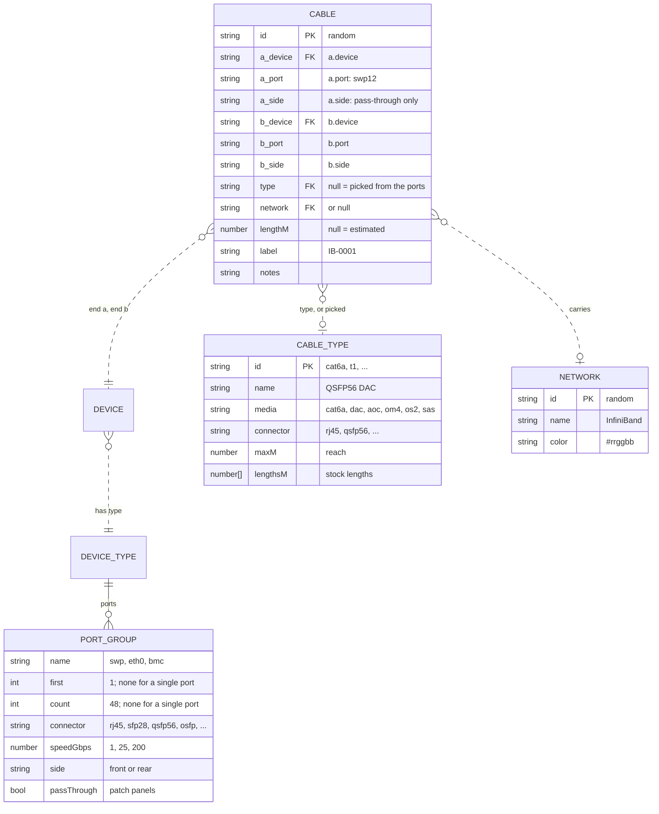
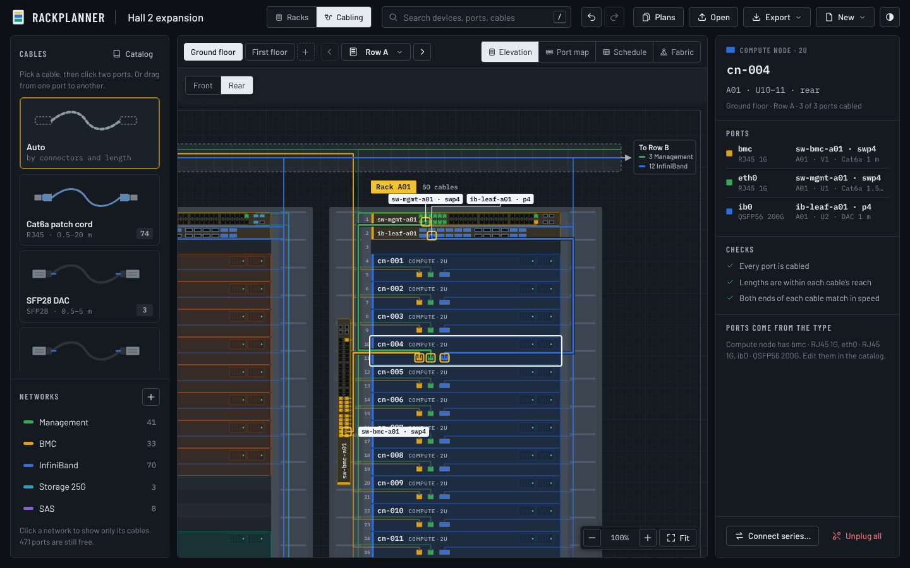

# Cabling: a proposal

Rackplanner places devices in racks. This proposal adds what it takes to plan
the physical cabling between them: named **ports** with a connector and a
speed on every device type, **cables** between two ports, **networks** to
color them by, and a catalog of **cable types** with the lengths you can
buy. The cabling is planned in its own workspace, so the rack elevation, the
floor map and the parts panel stay exactly as they are.

Nothing in the app has changed yet. The screenshots below are mockups drawn
into the running app with the example plan. The example now has real ports
on its device types and 155 cables between them, and the lengths, checks and
order lists in the pictures are computed from those ports and cables
(see [How the mockups are made](#how-the-mockups-are-made)).

1. [Data model](#1-data-model): what a plan file gains
2. [Shared additions](#2-shared-additions): workspace switch, panels, catalog
3. [Four approaches](#3-four-approaches) for the cabling views, with screenshots
4. [Comparison and recommendation](#4-comparison-and-recommendation)
5. [Open questions](#5-open-questions)

## 1. Data model

Four additions, in the style of the existing ones. Ports belong to the device
type, like height and power, because every device of a type has the same
ports. Cables, networks and cable types are new flat lists at the top level
that point at the rest by id, the way devices and clusters already do.

| Addition | Where | Like the existing |
| --- | --- | --- |
| `ports`: port groups | in each device type | `height`, `powerW` of a type |
| `networks`: named colors for cables | top-level list | `clusters` for devices |
| `cableTypes`: catalog with stock lengths | top-level list | `rackTypes` |
| `cables`: one per physical cable | top-level list | `devices` |
| `cabling`: settings for length estimates | top-level object | `info` |



The six `a_` and `b_` fields are two objects in the file, the cable's ends.

### Ports

A device type lists its ports in **groups**. A group with `first` and `count`
is a numbered series, a group without them is one port:

```json
"ports": [
  { "name": "swp", "first": 1,  "count": 48, "connector": "rj45", "speedGbps": 1,  "side": "rear" },
  { "name": "swp", "first": 49, "count": 4,  "connector": "sfp+", "speedGbps": 10, "side": "rear" }
]
```

is `swp1` … `swp52`, and the compute node of the example has three single
ports:

```json
"ports": [
  { "name": "bmc",  "connector": "rj45",   "speedGbps": 1,   "side": "rear" },
  { "name": "eth0", "connector": "rj45",   "speedGbps": 1,   "side": "rear" },
  { "name": "ib0",  "connector": "qsfp56", "speedGbps": 200, "side": "rear" }
]
```

- **Names** must be unique within a type. Cables refer to a port by its name,
  which keeps plan files and CSV exports readable (`cn-001 ib0`).
- **Type** of a port is its `connector` (the cage or jack); its **speed** is
  separate, in Gb/s, so an SFP28 port can run at 10 or 25. Connectors come
  from a fixed list, each with a family that decides which cables fit: RJ45;
  SFP+, SFP28, SFP56 (SFP family); QSFP+, QSFP28, QSFP56, QSFP112, QSFP-DD
  (QSFP family); OSFP; LC and MPO for fiber; Mini-SAS HD for storage.
- **Side** is where the ports face once the device is mounted. Switches that
  face the hot aisle list their ports on the rear.
- **Pass-through** groups are patch panels: every port has a front and a rear
  jack, which are connected inside the panel. A cable end on such a port also
  says `"side": "front"` or `"rear"`, and the app can follow a run from switch
  to switch through any number of panels.
- The catalog editor shows a group as one name pattern, `swp[1-48]`, and
  splits it into these fields; Netbox-style names such as `Ethernet1/[1-32]`
  work too.

### Cables

```json
{ "id": "cb-3", "a": { "device": "ex-9", "port": "ib0" }, "b": { "device": "ex-2", "port": "p1" },
  "type": null, "network": "n-ib", "lengthM": null, "label": "IB-0001", "notes": "" }
```

is the DAC between `cn-001 ib0` and `ib-leaf-a01 p1`. Two fields follow the
pattern of a device's `powerW`, where `null` means "take it from the type":

- `type: null` picks the cable type from the two ports: the first type in the
  catalog whose connector fits both ends and that reaches the estimated
  length. A QSFP56 link of 1.5 m gets a DAC, one of 6 m an AOC.
- `lengthM: null` estimates the length from where both ends are mounted and
  rounds it up to the next stock length of the type.

A cable from one port of a device to another of the same device is refused.
Each port takes one cable; a pass-through port takes one per side.

### Length estimate

The estimate follows the path a cable takes: from the port to the rack's
cable manager, up or down to the other end, or up into the tray above the
racks, along the row and across rows.

| Ends | Run |
| --- | --- |
| Same rack | height difference + 2 × 0.25 m to the cable manager |
| Same row | both ends up to the top of the rack + 2 × (0.3 m into the tray + 0.25 m) + racks apart × rack width |
| Same floor | as above + rows apart × row pitch |
| Different floors | no estimate: enter the length |

Then slack is added, and the result is rounded up to the cable type's next
stock length. Rack width (0.6 m), row pitch (3.0 m) and slack (10 %) are plan
settings in `cabling: { rackWidthM, rowPitchM, slackPct }`.

### Checks

Like placement, connecting is checked, but only two things are refused (a
second cable on a port, a cable from a device to itself). Everything else
is a warning that stays visible until it is fixed:

| Check | Example |
| --- | --- |
| Connectors don't fit each other | RJ45 to QSFP56 |
| Speeds differ | SFP28 server port on an SFP+ switch port: runs at 10 Gb/s |
| Longer than the cable type reaches | needs 3.6 m, QSFP56 DAC reaches 3 m |
| No cable type fits both ends | nothing in the catalog joins OSFP and QSFP56 |
| Ends on different floors | length must be entered by hand |

### What changes do to cables

| Change | Effect |
| --- | --- |
| Moving a device | Cables stay plugged in; estimated lengths follow. |
| Duplicating devices, a rack, a row, a floor | Cables between the copied devices are copied; cables to devices outside the copy are not. |
| Deleting a device (or its rack, row, floor, type) | Deletes its cables. |
| Removing or renaming ports in the catalog | Ports keep their cables by position within their group; the editor lists the cables it would unplug before a change that removes cabled ports. |
| Deleting a network | Its cables stay, without a network (like clusters). |
| Deleting a cable type | Refused while a cable uses it explicitly (like rack types); cables that picked it automatically pick again. |

### File format

Plan files go to version 4. Older files open with no ports, no cables, no
networks and the default cable types; types from the standard catalog get
their standard ports. Imported cables are checked like devices: unknown
devices or ports, and second cables on a port, are skipped and listed.
Proposed limits: 16 port groups and 1024 ports per type, 50 cable types,
20 000 cables per plan.

The CSV export gains a second file, the cable schedule (one row per cable,
with both ends, rack and position, type, length, network and label), and Open
reads it back.

Size: the example plan grows from 15 KB to 43 KB of JSON with its 155 cables,
and its share link from about 2.5 KB to 6 KB.

### Left out for now

Each of these fits into the model later without changing what is above:

- **Breakout cables** (a 400G port to 2 × 200G or 4 × 100G): a cable end
  would get a `lane`, and a cable could have several `b` ends.
- **Optics**: transceivers in SFP and QSFP cages, with fiber between them.
  Today an AOC or DAC stands for the whole link.
- **Ports of one device only**, such as an extra NIC: today that is a type of
  its own.
- **Cable status** (planned, ordered, installed) and **cable colors** other
  than the network's.
- **Power cords** from PDU outlets to power supplies: the same ports and
  cables with a power connector family (C13, C19).

## 2. Shared additions

These are part of every approach below.

**A workspace switch** in the top bar: **Racks** is today's app, unchanged;
**Cabling** swaps the stage, the left panel and the inspector for their
cabling versions. The floor tabs and the row picker stay and work the same
in both, so switching keeps your place. Search also finds ports and cables.

**The left panel** in Cabling lists the **cable types**, the way Racks lists
device types: pick one (or **Auto**) and click two ports to connect them, or
drag from port to port. Below are the **networks**, the way Racks lists
clusters: click one to see only its cables.

**The catalog** gets a **Ports** tab on each device type and a third tab for
**cable types**. A port group is one line: a name pattern, connector, speed
and side. The preview shows the front as today and the rear with its ports.

![The catalog editor with the 48-port switch selected and its new Ports tab: the front and rear drawings, and two port groups, swp[1-48] RJ45 1G on the rear and swp[49-52] SFP+ 10G on the rear, with Add ports and a note that 79 ports of this type are cabled.](screenshots/catalog-ports.png)

## 3. Four approaches

Each answers a different question. They can be built alone or side by side;
the screenshots show all four as views of the Cabling workspace to make
clear how they would sit together.

### A. Cabling elevation: the row from the rear, with every cable

*Where do the cables run, and what is plugged in where?*

The row drawn from the hot aisle, so the racks appear right to left (a note
says so, and **Front** shows the other side). Every device shows its rear
ports, cabled ones in their network's color. Cables run the way they are
installed: from the port into the cable manager at the side of the rack
(copper on the left, DAC and fiber on the right), along the tray above the
racks to other racks, and out to other rows with a count at the end of the
tray.

Click a device to see its cables drawn bold and the other end of each named
on the drawing, with every port, its peer, cable type and length in the
inspector. Click a port, then another port, to connect them. The same
drawing exports as PNG, SVG and print sheets like the elevation does today.


It works in the dark theme too:



**Good at:** seeing the plan as it will be built; spotting crowded managers
and long runs; explaining it to the people who install it. **Weak at:**
hundreds of cables at once (the bundles merge into lines), and fiddly for
connecting long series by hand. It needs the most new drawing code.

### B. Port map: what is on every port of a switch

*Which port of this switch goes where, and what is still free?*

The faceplates of a rack's switches (or patch panels, or any device), drawn
large. Each port is numbered and colored by network; above and below it
stands the name of the device at the other end, and a dot marks one in
another rack. Click a port to edit its cable in the inspector; click one port
and then another to connect them; drag across ports to connect a series.


**Good at:** patching switches and patch panels, finding free ports, port
labels for a printout per switch. **Weak at:** servers (three ports each make
a sparse picture) and at showing where cables run.

### C. Cable schedule: every cable as a table

*What exactly do we install, and what do we order?*

One row per cable, grouped by route: within a rack, between two racks of a
row, between rows. Each row has the label, both ends with rack and unit, the
cable type, speed and length (in italics while estimated) and the result of
the checks. Filter by text and network, group by route, network, device or
cable type, and switch between this row, the floor and the whole plan.
Select a cable to see its whole path in the inspector, through patch panels,
with every segment's type and length.

At the bottom: **what to order**, every cable type with its stock lengths and
counts, as a CSV order list or as printable cable labels.

![Cable schedule of Row A: collapsed groups for the cables within racks A01, A02 and A03 and between A01 and A02; open groups for A02 to A03, where IB-0026 is flagged too long for a DAC, and for Row A to Row B, with MGT-0030 from sw-mgmt-a01 swp47 to patch panel pp-b01-1 selected. The inspector shows its path: sw-mgmt-a01 swp47, a 5 m Cat6a cable, pp-b01-1 port 1 from rear to front, a 1 m Cat6a cable, sw-mgmt-b01 swp41. At the bottom the order list: Cat6a, SFP28 DAC, QSFP56 DAC, QSFP56 AOC and Mini-SAS HD cables by length.](screenshots/c-schedule.png)

**Connect series** pairs many devices with many ports in one step, the way
placing does for devices: pick the devices (or select them anywhere), the port
on each, the device and first port to connect them to, the network, cable
type and a label pattern. The preview shows each cable with its type and
estimated length before anything is connected. It is also on the device and
port inspectors of approaches A and B.


**Good at:** large plans, bulk edits, exactness, export and ordering; the
least new drawing code. **Weak at:** seeing anything spatially.

### D. Fabric: how the network is built

*Is every node connected, with enough uplinks?*

One network at a time drawn as a graph: core switches on top, leaves below,
nodes at the bottom. Nodes with the same links and the same cluster are one
box (`cn-001 … 012`, 12 compute nodes). Line width grows with the number of
links, each leaf shows its ports in use and its oversubscription, down links
to up links, red above 3 : 1. The inspector lists a switch's links and checks
for the whole fabric.


**Good at:** checking a fabric design (redundancy, oversubscription, growth
room), and talking about it. **Weak at:** anything physical; it says nothing
about racks or lengths. Best as a second step.

## 4. Comparison and recommendation

| | A Elevation | B Port map | C Schedule | D Fabric |
| --- | --- | --- | --- | --- |
| Answers | where cables run | what is on each port | what to install and order | is the network right |
| Scales to 1000s of cables | partly | yes, per device | yes | yes, grouped |
| Connecting | port to port | port to port, series | series, table | no |
| Lengths and order list | shown per cable | shown per cable | full | no |
| Prints as | drawing sheets | a sheet per switch | schedule, labels | diagram |
| New code | large | medium | medium | medium |

**Recommendation:** start with the data model, the catalog's Ports tab and
**C, the schedule**, with Connect series and the order list: it is where a
cabling plan is made and checked, and it scales from day one. Add **A, the
elevation**, second: it is what makes the plan visible and is the natural
companion of today's elevation. **B** then comes almost for free as the
inspector of a selected switch in A, and as a print sheet per switch. **D**
can wait until there is a fabric to check.

## 5. Open questions

1. **Mounting direction.** Ports face the side given in the type. Should a
   device instead record that it is mounted back to front (common for
   switches), so one switch type serves both ways and the front drawing shows
   its power side?
2. **Breakouts** (one 400G port to two 200G ports): needed in the first
   version?
3. **Patch panels** with pass-through as proposed, or just as devices with
   ports for now?
4. **Lengths:** are rack width, row pitch and slack per plan enough, or do
   rows need their own position on the floor (for runs between rows of
   different length)?
5. **Labels:** one pattern per network (`IB-0001`), or your own scheme?
6. Which approaches to build, and in which order.

## How the mockups are made

`prototype.js` is the data model above as code without the app: ports from
port groups, cables, the length estimate, cable type selection, the checks,
the path through patch panels and the order list, plus the example's ports
and cables. `mockups.js` and `mockups.css` draw the four views into the
running app, using its styles and drawing code; nothing there is interactive.
`shoot.js` takes the screenshots:

```sh
npm ci                       # once, for Playwright
node docs/cabling/shoot.js   # or name some: node docs/cabling/shoot.js c-schedule
```
